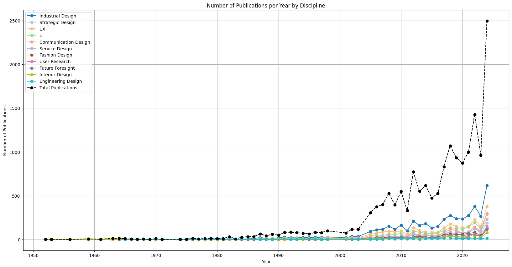
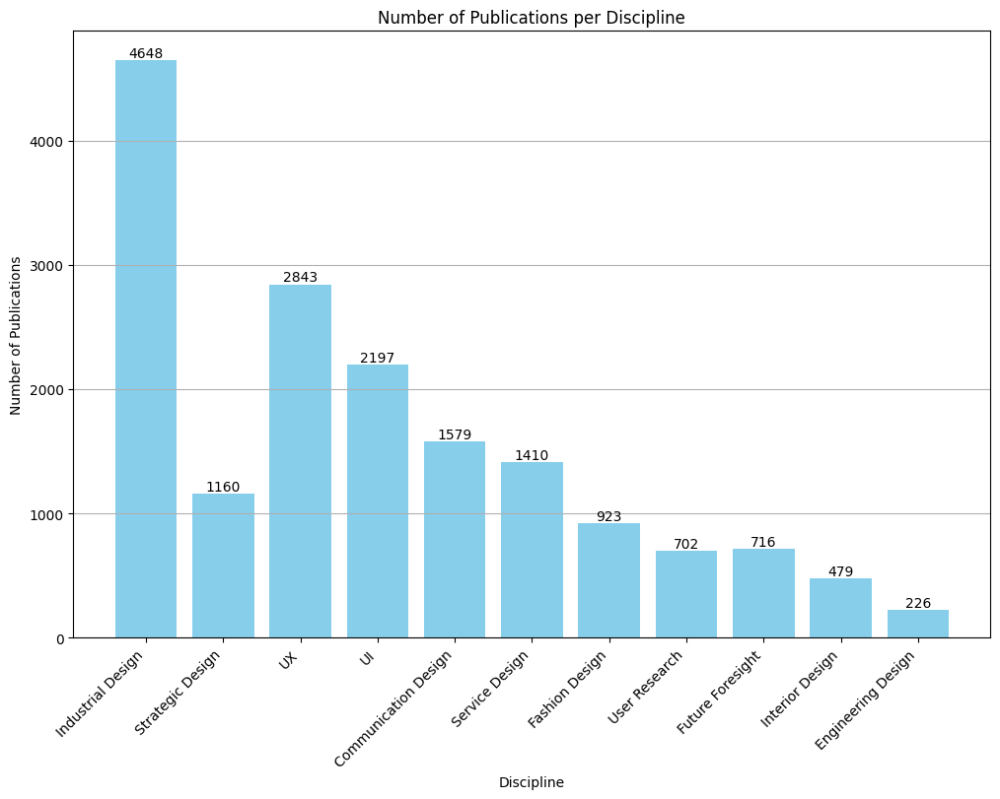

# 🚀 IAFastro Project – Web Scraping & Analysis of Aerospace Design Publications

Welcome to the **IAFastro Project**, a data-driven exploration into how scientific interest in **design disciplines** has evolved over time within the aerospace domain.

This project scrapes, filters, and visualizes data from the [International Astronautical Federation's digital library](https://dl.iafastro.directory/), aiming to uncover trends in aerospace-related design research.

---

## 🧠 Motivation

Design plays a critical role in the success of aerospace missions — from user interfaces in mission control to textiles in space suits 👩‍🚀. This project investigates **how frequently design disciplines appear in scientific publications**, identifying which areas have gained traction over the years.

---

## 💥 The Challenge

The IAF digital library has **no official API** (😱), and navigating through thousands of records requires:

- Handling **multiple search terms**.
- Scraping **every result page** without being blocked 🤖.
- Extracting **deep metadata** like `Paper ID` and `Abstract` from individual detail pages.

### 💡 My solution?

1. Created a **custom pagination system** that dynamically builds all search URLs.
2. Used headers and polite delays to **simulate human-like browsing behavior** 🕵️‍♂️.
3. Extracted, cleaned, and classified data across multiple design disciplines using regular expressions and keyword sets.

---

## 🧩 Project Structure

AIFastro_project/
│
├── data_web_scrapper.py # Crawls the IAF digital library and saves raw paper metadata
├── files_generator.py # Filters and classifies papers by design discipline using regex
├── viz_generation.py # Creates bar and line charts to visualize publication trends
│
├── /filtered_data/ # Contains discipline-specific filtered CSVs
└── /visualizations/ # (Optional) Save generated plots here


---

## 🔧 Requirements

Install the following Python libraries (preferably in a virtual environment):

```bash
pip install pandas requests beautifulsoup4 regex matplotlib
```

## 🧪 How to Run the Project
### Step 1: Scrape all relevant papers


```bash
python data_web_scrapper.py
```
This will create one CSV per search term (e.g., IAF_Papers_with_abstracts_Design.csv).

### Step 2: Filter and classify papers by design discipline
```bash
python files_generator.py
```

### Step 3: Generate the visualizations
```bash
python viz_generation.py
```

You’ll see:

📈 A line chart showing publication trends by year and discipline.

📊 A bar chart comparing the number of papers per discipline.

---
## 📦 Example Output





---
## 🙌 Acknowledgements
- Data from the International Astronautical Federation

- This project was built with coffee, curiosity, and an unhealthy fascination for regex ☕🔍

---
## 🤓 Author
Carlos Enrique Sánchez Martínez
Data Scientist • Educator • Maker of Things that Make You Say “Huh, that’s clever!”

Connect on [LinkedIn](https://www.linkedin.com/in/thecarlos/) or send space jokes via email at thecarlossanchezm@gmail.com ✉️

---
## ⚠️ Disclaimer
This project is for academic and research purposes only. All data belongs to its respective owners. Always scrape responsibly 🚦

---
## Document
Find the publicated file on the repo as "Output_paper.pdf".

---

## 🌍 Personal Note

Our paper was presented at the **International Astronautical Congress 2024** in **Milan, Italy** 🇮🇹.

Although I couldn’t attend in person, I’ll be adding a photo of myself next to the screen where our work was featured 📸.


> *Here's a snapshot of our work being shown in a faraway country. Today, a part of my software lives inside a scientific document – and for me, that's a monumental professional achievement. I'm deeply grateful.*

🚀✨
